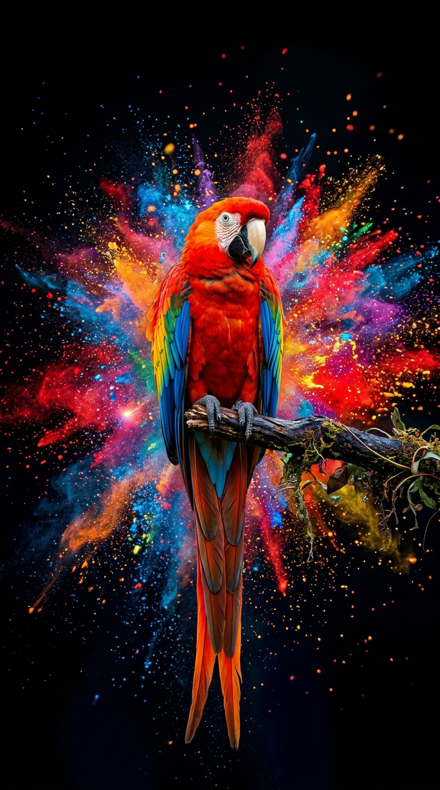
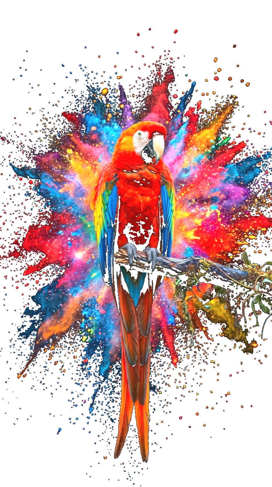

# DTF Halftone Maker 🎨

A professional-grade, high-performance web application designed to transform raster images into production-ready **halftone patterns** specifically optimized for **Direct-to-Film (DTF) printing**.


---

## 📸 Usage Example

Transform standard high-resolution photography into stylized, printable halftone art in seconds.

| Original Image | Halftone Pattern Result |
| :---: | :---: |
|  |  |

---

## ✨ Premium Features

### 🛠 Professional Halftone Engine
- **Multiple Dot Shapes**: Choose between **Round, Square, Ellipse, Diamond, and Line** patterns.
- **Precision Controls**: Fine-tune grid size (LPI), rotation angle, and dot density.
- **White Preservation**: Advanced logic to maintain highlights while ensuring smooth gradients.

### 👕 Premium Mockup System
- **Realistic Garment Visualization**: High-quality SVG shirt with interactive fabric textures and shading.
- **Interactive Manipulation**: Drag your design to position it perfectly and use the mouse wheel or slider to scale it independently.
- **Visual Integrity**: Utilizes CSS blend modes (Multiply) and SVG filters to make the design feel part of the fabric.

### 📊 Advanced Image Processing
- **Real-time Histogram**: Interactive levels adjustment with gamma correction to prepare your image before the halftone process.
- **Web Worker Architecture**: All heavy processing is offloaded to background threads, keeping the UI responsive even with 4K images.
- **100% Private**: Your images never leave your computer. Everything happens locally in your browser.

### 💾 Versatile Export Options
- **Transparent PNG**: High-resolution output for direct printing.
- **Vector SVG**: Fully scalable vector dots for large-format applications.

---

## 🚀 Installation & Setup

```bash
# Clone the repository
git clone https://github.com/your-username/dtf-halftone-maker.git

# Install dependencies
npm install

# Start the development server
npm run dev

# Build for production
npm run build
```

---

## 🇫🇷 Version Française

### À propos de DTF Halftone Maker
Une application web de pointe pour transformer vos images en **trames demi-teinte (halftones)** haute définition, optimisées pour l'impression DTF. Tout le traitement est **100% local**, garantissant rapidité et confidentialité totale.

### ✨ Fonctionnalités Clés
- **Moteur de Trame Professionnel** : 5 formes de points (Rond, Carré, Ellipse, Losange, Ligne) avec contrôle précis de l'angle et de la linéature.
- **Système de Mockup Premium** : Visualisez vos créations sur des vêtements réalistes. Déplacez et redimensionnez votre design directement sur le t-shirt par glisser-déposer.
- **Ajustement des Niveaux** : Histogramme interactif pour régler le contraste et le gamma en temps réel.
- **Performance Web Worker** : Traitement fluide et asynchrone pour les images haute résolution.
- **Exports Flexibles** : Téléchargez vos fichiers en PNG transparent ou en SVG vectoriel.

---

## 📄 License
MIT © [Amidou ZABRE]

